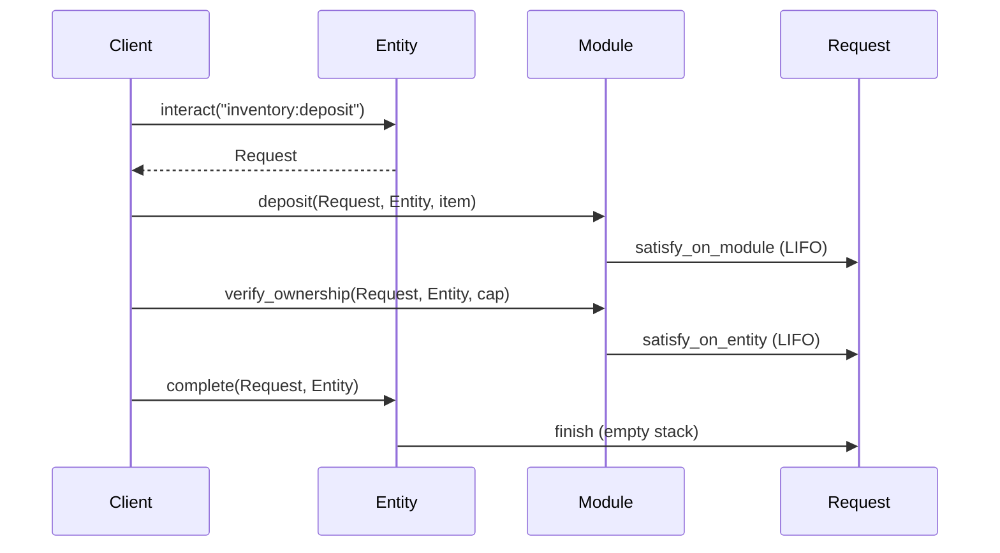
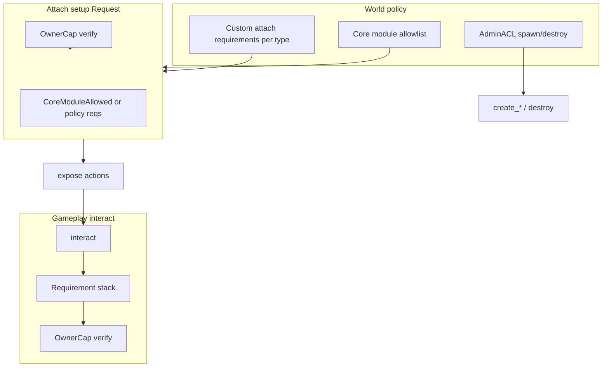

# Entity Accumulator POC

Prototype of a universal **Entity** shell with entity-scoped accumulators, attachable modules, and the [world_3](https://github.com/amnn/world-contracts/tree/amnn/world-3/contracts/world_3) **Action → interact → Request → Requirement** interaction model. On-chain **PTB templates** use the [`ptb`](https://github.com/MystenLabs/pas) package.

## What this POC is for

We are validating four ideas in one minimal codebase:

1. **Entity-scoped accumulators** — rolled-up state (mass, energy, inventory volume, connection flags) on the entity `UID`; module **inner** state stays in `Module<M>.inner` inside the entity’s `Bag`.
2. **world_3-style gated actions** — every gameplay step is an action with a requirement stack; PTBs satisfy requirements in order and finish with `complete`.
3. **Practical module attachment** — modules install into the entity `Bag`, return a **setup `Request`**, and use the same requirement machinery as gameplay. **Owners** attach; **admins** configure core allowlist + per-type attach requirements for custom modules (see [Access and customization](#access-and-customization)).
4. **One shell for characters and world objects** — player characters are `Entity` values (via `create_character`), not a parallel on-chain object model; gameplay extensions are modules on that same shell.

---

## Entity data model (two layers on one object)

Each **`Entity`** is a single shared object. Gameplay state is split into two cooperating layers—not merged into one blob:

```text
Entity (shared object)
├── id: UID
│   ├── accumulators (DF on UID)     ← entity-wide totals / flags
│   └── InFlight, …                  ← interact guard (DF on UID)
├── modules: Bag
│   └── "<instance>" → Module<M> { entity, name, inner }
│       e.g. "inventory" → InventoryModule { items, max_volume, … }
│       e.g. "energy"    → EnergyModule { max_capacity }
│       e.g. "gun:port"  → GunModule { … }     // multiple same-type OK
└── actions: VecMap<String, Action>  ← named interact entrypoints + requirements
```

| Layer | Where | What lives here |
|-------|--------|------------------|
| **Accumulators** | `entity.id` (UID dynamic fields) | Aggregates: mass, energy, **used** inventory volume, connection flag bits. One cell per marker **type** per entity—not per module instance. |
| **Module inner** | `Module<M>.inner` in the **Bag** | Module-specific authoritative state (e.g. `InventoryModule.items` with per-stack `quantity`, capacity config, tribe id, …). |
| **Module wrapper** | `Module<M>` fields `entity`, `name` | Wiring for satisfy checks and MVR (`world:module`); not gameplay totals. |
| **Actions** | `entity.actions` | Which named flows exist and which requirements they need. |

### `Module<M>`: wrapper vs inner

Every installed module is a `world::module_::Module<M>` in the entity **Bag**. Only **`inner: M`** is module-type-specific; the wrapper is shared shape for all modules:

```move
public struct Module<M> has store {
    entity: ID,      // parent entity — satisfy / consistency checks
    name: String,    // instance id (Bag key), e.g. "inventory", "gun:port"
    inner: M,        // per-package *Module struct — gameplay state for this instance
}
```

| Part | Owned by | Put here |
|------|----------|----------|
| **`entity`** | `module_` (set at `install`) | Do not extend. Proves this `Module` belongs to that entity when satisfying `on_module` requirements. |
| **`name`** | `module_` (Bag key / instance id) | Do not duplicate in `inner` unless you need it inside handlers that only see `&Module<M>` without the key string. Prefer `module_::instance_name` at boundaries. |
| **`inner`** | Each `module_*` package | **All instance-local gameplay state** for that module type: item vectors, per-instance caps, tribe id, display name, etc. |

The wrapper is **not** a second gameplay layer—it is the MVR/install envelope around **`inner`**. Accumulators are **not** stored on `Module<M>`; they stay on `entity.id` (UID).

### Where to put new state (standard)

Use this decision order when adding fields or markers:

1. **Entity shell (`Entity` + `actions`)** — Only cross-cutting shell concerns: registered action names, requirement stacks, `InFlight`, `EntityKind`, `owner_cap_id`. Not module gameplay state.

2. **UID accumulator** (`entity_accumulator`, one cell per marker **type** per entity) — Use when the value is:
   - A **sum or balance** other modules or services read without opening every bag entry (mass, energy, used inventory volume).
   - An **entity-wide bitmask / flag** derived from which modules are attached (`module_flags` → `Flags` on UID).
   - Updated in the **same transaction** as the authoritative change in some module `inner` (deposit: items in `InventoryModule`, volume/mass on UID).

   Do **not** add a per-instance accumulator key for each Bag entry (e.g. two inventories → still one `InventoryVolume` total on the UID unless you deliberately design per-marker splits).

3. **`Module<M>.inner`** — Use when the value is:
   - **Authoritative detail** for one instance (item list, slot count, `max_volume` for *this* inventory).
   - **Only consulted by that module’s logic** (metadata display name, inventory caps, etc.).
   - **Per-instance limits** that other code should read via `borrow_module` / `max_volume_instance`, not by scanning the Bag.

4. **Neither (separate objects)** — Items, caps, NFTs, etc. stay as their own types; modules hold references or vectors in `inner`, not on the wrapper.

**Consistency rule:** If both `inner` and an accumulator represent the same quantity, **`inner` is authoritative for detail**, the accumulator is the **rolled-up entity view**. Every mutating path must update both in one PTB step (see `deposit_instance` in `module_inventory`). Avoid storing the same total only in `inner` and expecting other modules to read it—use the accumulator.

**Attach / detach:** On `install`, call idempotent `ensure_*` / `init_*` on the UID when the module participates in a shared marker. On attach, set connection bits (`module_flags::mark_connected`) when other systems gate on “module present”. Detach teardown for shared accumulators is not fully designed yet (see below).

**MVR templates:** Handlers that take `&mut Module<InventoryModule>` (`deposit_module`) may only touch **`inner`** in one step; entity-wide accumulators may need a **separate** PTB step on `&mut Entity` / UID in the template chain. Gameplay paths that take `&mut Entity` should keep inner + accumulator in sync in one function.

### POC examples (wrapper vs inner vs accumulator)

| Module | `inner` (authoritative, per instance) | UID accumulator / shell | Notes |
|--------|--------------------------------------|-------------------------|--------|
| `InventoryModule` | `items`, `max_slots`, `max_volume` | `Mass`, `InventoryVolume` (used volume) | Deposit updates vector + merges mass/volume on UID. Limit (`max_volume`) in inner; used total on UID for cross-checks. |
| `EnergyModule` | `max_capacity` only | `Energy` (current stored energy) | Discharge reads/writes **accumulator**; inner holds cap config, not the live pool (could be filled by other systems later). |
| `FlagsModule` | `{}` (empty) | `Flags` bitmask | Module exists to run attach hooks; **all** connection state on UID via `mark_connected`. |
| `MetadataModule` | `display_name`, `tags` | — | Purely local; other modules do not aggregate this. |
| `TribeModule` | `tribe_id` | — | Affiliation per instance; entity-wide tribe rules would use accumulators or services later. |
| `OwnerModule` / `AdminModule` | `{}` or minimal | — | Capability / ACL modules; state lives in caps and access packages, not accumulators. |

### Anti-patterns

- Storing **entity-wide totals** only inside one module’s `inner` when another module must enforce a limit (e.g. mass) without borrowing that instance.
- Putting **gameplay fields** on `Module<M>.entity` / `name` instead of `inner`.
- **Two inventories** each maintaining their own “total mass” in inner with no UID `Mass` merge—breaks entity-level physics checks.
- Updating **`deposit_module`** inner without a matching accumulator step when the action is supposed to affect entity-wide mass/volume.

### Does the two-layer model defeat “pure” accumulators?

**No—not if we keep the split of responsibilities:**

- **Accumulators** = fast, entity-wide **aggregates** (and cross-module signals like “energy module connected”).
- **Module inner** = **source of truth** for detail the aggregate summarizes (e.g. item vectors; inventory deposit updates both).

That is intentional **denormalization**, not abandoning accumulators: deposit merges into `Mass` / `InventoryVolume` on the UID *and* stores items in `InventoryModule.inner`. A purer single-layer design would force every module to scan all other modules to compute totals—we avoid that.

What would weaken the model is **duplicating authoritative totals only in module inners** with no accumulators, or **two writers** updating the same aggregate without a single `ensure_*` / merge path. The POC centralizes roll-ups in `entity_accumulator`.

### PTB “object congestion” during an action flow

A typical gated action passes more **references** than a toy “entity + accumulator only” sketch:

```text
entity::interact(shared Entity)           → Request (hot potato)
module_inventory::deposit(req, entity, item)
module_owner::verify_ownership(req, entity, cap)
entity::complete(req, entity)
```

MVR-shaped templates add **`world:module`** when the handler is written against `&Module<M>` (`deposit_module`). That is comparable to world_3 (structure + module + request + caps/items)—the extra handles come from **composable requirements and MVR**, not from splitting accumulators vs module inners.

Accumulators on the UID **reduce** object count versus modeling each aggregate as its own on-chain object: mass/energy/volume/flags stay **fields under the same entity**, not separate shared objects per counter.

### Shared accumulators on attach / detach

- **Install:** Mostly safe today via idempotent `ensure_u64` (e.g. `init_inventory_volume`, `init_on_uid` at create). Multiple modules can touch the same marker; the first call creates the cell, later calls are no-ops.
- **Teardown:** Removing a module from the **Bag** does **not** today clear or refcount UID accumulators—only test helpers tear down the whole entity. Production detach policy (refcount, reset) is follow-up work.

---

## Quick start

```bash
# Terminal 1 — local Sui
pnpm localnet

# Terminal 2 (optional) — point CLI at the same network
./scripts/use-localnet.sh

# Move unit tests
pnpm test:move

# Publish to local node
pnpm publish:local

# App
cp .env.example .env   # set VITE_WORLD_PACKAGE_ID
pnpm install
pnpm dev
```

**Why `test:move` uses `-e testnet`:** Sui 1.63+ does not allow `localnet` in `Move.toml` environments. Unit tests compile against the testnet framework revision only.

---

## Interaction flow (aligned with world_3)

```text
expose(action)          — register named action + requirement list on entity
interact(entity, name)  — start flow; returns Request hot-potato
satisfy_* (per step)    — pop LIFO requirement; module/entity handlers
complete(request, ent)  — assert stack empty; clear InFlight
```

Example deposit PTB (hand-built client, same shape as world_3):

```text
entity::interact(entity, "inventory:deposit")  → Request
module_inventory::deposit(request, entity, item)
module_owner::verify_ownership(request, entity, cap)
entity::complete(request, entity)
```



---

## Access and customization

The POC uses the **same `Request` + `Requirement` machinery** for world setup, module attach, and gameplay. There is no second auth system—only different **who** and **which requirements** apply per flow.

### Policy summary (implemented)

| Flow | Who initiates | World policy | On-chain entry |
|------|----------------|--------------|----------------|
| **Spawn / destroy entity** | Admin (`AdminACL`) | `SystemAuthorization` | `create_*` setup `Request`; `entity::destroy_entity` (empty shell) |
| **Attach core module** | **Entity owner** (`OwnerCap`) | Type on **core allowlist** | `module_attach::attach_core_setup` → `CoreModuleAllowed` |
| **Attach custom module** | **Entity owner** | **Admin-defined requirement stack** per module inner type | `module_attach::attach_custom_setup` → policy `Requirement`s |
| **Run exposed action** | Entity owner | Per-action stack from `expose` (+ services, owner, …) | `interact` → `Request` |
| **Tweak existing actions** | Entity owner | Extra requirements on a named action | `module_owner::add_custom_requirement` |

**Re-alignment from early POC notes:** attach is **not** admin-driven. Admins do **not** install modules on player entities. They configure **world rules**; **owners** run attach PTBs and satisfy setup requirements (same LIFO pattern as gameplay).

### Two module attach paths

**1. Core / first-party modules (allowlist + owner)**

Ship modules such as `module_inventory`, `module_energy`, `module_tribe` use a shared pattern:

1. `module_*::install` / `attach` writes `Module<M>` into the entity `Bag`.
2. Returns a setup `Request` with **`OwnerAuthorization`** + **`CoreModuleAllowed`** (`core_module_auth` marker).
3. Owner satisfies **`CoreModuleAllowed`** against shared **`ModuleRegistry`** (type must be on allowlist via `add_core_module`).
4. Owner satisfies **`OwnerAuthorization`** with `OwnerCap`.
5. `request::finish` / `entity::complete` clears the setup stack.

```text
# Deploy: admin registers core inner types once per world
module_registry::add_core_module<InventoryModule>(registry, admin_acl, ctx);

# Gameplay: owner attaches inventory on their ship
let req = module_inventory::attach(&mut entity, max_slots, max_volume, ctx);
module_attach::satisfy_core_module<InventoryModule>(&mut req, &registry);
module_owner::verify_ownership(&mut req, &entity, &owner_cap);
request::finish(req);
```

**2. Custom / third-party modules (admin requirement stack + owner)**

Third-party modules use **`attach_custom_setup`**: the setup `Request` is **`OwnerAuthorization`** plus whatever **`Requirement`s** the admin stored for that inner type. No separate item-only registry—item gating is just one optional requirement type.

```text
# Deploy: admin defines attach policy (any combination of services)
module_registry::set_custom_attach_policy<MyCustomModule>(
    registry,
    admin_acl,
    vector[
        install_item_service::requirement(item::attach_demo_item_type_id()),
        // location_service::requirement(b"shipyard"),
    ],
    ctx,
);

# Gameplay: owner attaches custom mod (satisfy policy reqs LIFO, then owner)
let req = my_package::attach(&mut entity, &registry, ctx);
install_item_service::satisfy_consume_item(&mut req, &entity, install_item, ctx);
module_owner::verify_ownership(&mut req, &entity, &owner_cap);
request::finish(req);
```

Admins can stack **any published requirement** on custom attach: `install_item_service` (consume item), `location_service` (proximity), future cap/tribe markers, etc. Clients discover satisfy steps via the same `announce_service` / PTB template path as gameplay.

**POC tests** use `module_custom_fixture` (attach-only stub, no gameplay actions). **Example without items:** policy `vector[location_service::requirement(b"shipyard")]` — owner must satisfy proximity to attach.

### Admin APIs (`ModuleRegistry`)

| API | Purpose |
|-----|---------|
| `add_core_module<M>` | Allow core inner type `M` on this world (inventory, energy, …) |
| `set_custom_attach_policy<M>` | Set/replace attach requirement stack for custom inner type `M` |
| `assert_core_module_allowed<M>` / `satisfy_core_module` | Used in attach PTBs for core path |

Shared object: **`ModuleRegistry`** (created in `module_registry::init`). **`core_module_auth`** holds the `CoreModuleAllowed` marker and `internal::permit` (avoids import cycles with `module_owner` / `module_attach`).

### Create / destroy vs attach

| Operation | Gate |
|-----------|------|
| `create_character` / `create_in_space` | Admin satisfies `SystemAuthorization` on returned setup `Request` |
| `destroy_entity` | Admin + empty `Bag` / no registered actions |
| `module_*::attach` | **Owner** + core allowlist **or** custom policy (never admin-as-attacher) |

**POC caveat:** `install` still **writes the Bag before** returning the setup `Request`. Failed or incomplete satisfy steps do not roll back the install; production may defer Bag writes until the stack is cleared.

**Tests:** `entity_core_tests` (owner attach, custom policy + `install_item_service`, core allowlist abort); `entity_tests` (integration smoke). All **28** unit tests pass on testnet framework.

### Owner layer — gameplay `interact`

The holder of that entity’s **`OwnerCap`** satisfies `OwnerAuthorization` on exposed actions (`inventory:deposit`, `metadata:set_name`, …), usually last in the LIFO stack.

| When | Gate |
|------|------|
| `entity::interact(...)` | Requirements from `expose` (+ owner, services, custom additions) |
| Extend existing action | `module_owner::add_custom_requirement` — adds a requirement to a named action without re-`expose` |
| Bundle actions | `entity::expose_composite` — merges requirement lists from existing action names |

### Gameplay flows: customization with and without new modules

**A. Custom requirements on existing modules (in POC)**

Owner already attaches core modules (inventory, owner, …). Without installing a new package, the owner can tighten or compose flows:

```text
module_owner::add_custom_requirement(&mut entity, &cap, b"inventory:deposit", location_req);
entity::interact(entity, b"inventory:deposit")  → 3 requirements (deposit + owner + location)
```

Or define a composite interact name that merges multiple action stacks (`expose_composite` — tested with inventory deposit + withdraw).

**B. Custom module + new actions**

Third-party packages ship `module_*::attach(&registry, …)` using `attach_custom_setup` + `expose`. Admin calls `set_custom_attach_policy` at deploy; owners satisfy that stack when attaching (see [Two module attach paths](#two-module-attach-paths)). After attach, `expose` registers gameplay actions consumed via `interact` as usual.

**C. Custom module + custom requirement markers on someone else’s action**

After attach, the owner can still use `add_custom_requirement` to stack a marker from the new module (or a service) onto an action exposed by another module—same cross-module composition as (A), as long as both modules are installed and requirements are satisfiable in one PTB.

**What is not “custom” in this model:** arbitrary un-audited Move uploaded at runtime. “Custom module” means a **published package** with an admin-defined attach policy on `ModuleRegistry`.



---

## Package layout

```
packages/world/sources/
  core/         entity, module_, request, action, requirement, entity_accumulator, character
  modules/      inventory, owner, metadata, energy, flags, custom_fixture (attach-policy tests), …
  services/     system_service, location_service, install_item_service, module_attach, discovery
  access/       owner_cap, admin_acl, system_auth, module_registry, core_module_auth
  objects/      item (stackable inventory objects)
app/            minimal React PTB demo (direct moveCall, no TS SDK)
```

---

## Differential analysis: world_3 vs this POC

References:

- **[world_3](https://github.com/amnn/world-contracts/tree/amnn/world-3/contracts/world_3)** — minimal core in `world-contracts/contracts/world_3` (`Structure`, `Bag`, `Module<M>`, LIFO `Request`).
- **`ptb-templates-demo`** — production-shaped demo in this repo (`Assembly`, `ApplicationRequest`, `discovery`, services). Same *ideas*, different request completion API on assemblies.
- **This POC** — world_3 **interact → satisfy (LIFO) → complete** semantics on an **`Entity`** shell, plus accumulators and demo-style discovery.

### At a glance

| Area | world_3 (minimal core) | ptb-templates-demo | This POC |
|------|------------------------|--------------------|----------|
| Shell object | `Structure` | `Assembly` (+ inner via DF) | `Entity` (`EntityKind`, `owner_cap_id`) |
| Module storage | `Bag` + `Module<M> { structure, name, inner }` | Inner on `Assembly` DF; hardware as separate pkgs | `Bag` + `Module<M> { entity, name, inner }` |
| Request type | `structure::Request` (hot potato) | `ApplicationRequest` (mutable, versioned) | `request::Request` (hot potato) |
| Start flow | `structure::interact` | `assembly::interact` / `gate::jump` | `entity::interact` |
| Satisfy order | **LIFO** (`pop_back`) | **By type** (`find_index` + `swap_remove`) | **LIFO** (same as world_3) |
| Finish flow | `structure::complete` | `request::complete` | `request::finish` + `entity::complete` |
| Action registry | `expose` → `VecMap<String, Action>` | Requirements on `Assembly` + named interact | `expose` / `expose_composite` on `Entity` |
| `Action.version` | Not in core `action.move` | On `ApplicationRequest` | On `Action` + `expose(..., version)` |
| Install / expose | `install` + `expose` on shell | Package-specific attach flows | Per-module `install` / `expose` / `attach`; `ACTION_VERSION` on all `module_*` |
| Inventory PTB path | `deposit(req, &mut Module<Inventory>, item)` | Via `inventory_service` + assembly | **Both** `deposit(req, entity, item)` and `deposit_module(req, module_, item)` |
| PTB ext slots | `world:request`, `world:structure`, `world:module` | Demo uses `discovery::Tag` namespace | `world:request`, `world:entity`, `world:module` |
| Discovery / templates | Not in world_3 package | `discovery` + `ptb_template` + devInspect | Same pattern; wired in POC `init` + `app/` |
| Entity-wide aggregates | Not in world_3 core | Not in demo core | **`entity_accumulator`** on UID |
| Player character | Not in world_3 core | Separate `Character` object | **`create_character` → same `Entity`** |
| Create / attach gating | `install` TODO in source | `SystemAuthorization` on `assembly::new` | Create/destroy: admin; core attach: owner + allowlist; custom attach: owner + admin requirement stack ([details](#access-and-customization)) |

### What we intentionally kept (world_3 interaction core)

These are the parts we treat as **non-negotiable** when merging toward production:

```text
expose(action on shell)  →  interact(name)  →  Request + requirement stack
       →  satisfy_on_module / satisfy_on_entity (LIFO pop_back)
       →  complete / finish (empty stack, clear InFlight)
```

- **Requirement shape** — `TypeName` + optional module instance `name` + `data` (POC adds `on_entity` / `on_module` sugar over `requirement::new`).
- **`Module<M>` in a `Bag`** — instance id string (`Module::name`) must match `requirement::on_module`’s name; multiple same-type modules via distinct names (`gun:port`, …).
- **Phantom marker types** — `Deposit`, `OwnerAuthorization`, `ProximityToLocation`, etc., with `internal::Permit<T>` at satisfy sites.
- **Inventory deposit ordering** — module slot + owner (and optional services) composed as separate requirements; PTB satisfies in **reverse** expose order (LIFO).

`ptb-templates-demo` is **not** a drop-in match for the POC request API: there, `ApplicationRequest::complete_requirement` removes requirements **by type index**, and assembly `interact` **folds** assembly-level requirements into a builder. The POC deliberately stayed on world_3’s **stack** model.

### Where this POC extends world_3 (additive)

| Extension | Notes |
|-----------|--------|
| **`entity_accumulator`** | UID cells for `Mass`, `Energy`, `InventoryVolume`, `Flags` — main POC hypothesis; not in world_3 core. |
| **`expose_composite`** | Merge requirements from existing action names into one interact entrypoint. |
| **`Action.version`** | `action::new_versioned`; every `module_*` checks `ACTION_VERSION` in `expose`. |
| **Split `install` / `expose`** | Production-shaped two-step attach; `attach` wrapper for tests. world_3 `install` still has a TODO for setup requests. |
| **Discovery + devInspect** | From demo stack: `announce_service`, `ptb_template_*`, client resolver in `app/`. |
| **Dual inventory handlers** | `deposit` / `withdraw` on `&mut Entity` (accumulators + inner); `deposit_module` for MVR templates. |
| **Setup `Request` on create/attach** | Admin spawn/destroy; owner attach with `ModuleRegistry` (core + custom policies) — [Access and customization](#access-and-customization). |
| **`EInteractInFlight` guard** | Second `interact` while in flight aborts; world_3 sets `InFlight` without an explicit pre-check. |
| **`requirement::append_all`** | Used by `expose_composite` to copy requirement vectors from existing actions. |

### Where this POC differs by design (renames & structure)

#### 1. `Entity` shell instead of `Structure`

| | world_3 | POC |
|---|---------|-----|
| Shell type | `Structure` | `Entity` |
| PTB slot | `world:structure` | `world:entity` |
| Player character | Often a separate type / package (e.g. `Character` in demos) | `entity::create_character` → same `Entity` as ships, stations, etc. |

**Why:** This POC is about a **universal entity model** (characters, in-space objects, shared accumulators). The shell is the same role as `Structure`; we renamed it to match the accumulator narrative and avoid confusion with “building/structure” in gameplay docs. PTB helpers live on `request` (`request::entity()`), mirroring `request::structure()` in world_3.

#### Characters are Entities (same interact model, extensible via modules)

We deliberately do **not** fork a second on-chain “character contract” with its own action system. A player character is an `Entity` with `EntityKind { in_space: false }`, created through `entity::create_character`, gated by `OwnerCap`, and extended by attaching modules—the same path as an in-space ship or facility uses with `create_in_space`.

The thin `world::character` module in this repo only adds **character-specific helpers** (e.g. receive/return item flows that assert `!is_in_space`). It does not replace the entity shell.

**Product intent:**

| Capability | How it maps to this model |
|------------|---------------------------|
| **Skill tree / progression** | A `module_skills` (future) attaches to the character `Entity`, stores unlocked nodes in module inner state, and `expose`s actions like `skills:unlock_node` with requirements (owner, prerequisites, resource cost). |
| **Inventory, energy, metadata** | Already demonstrated: `module_inventory`, `module_energy`, `module_metadata` attach to the same `Entity` a character uses. |
| **Tribe / guild** | `module_tribe` (stub today) attaches `TribeModule { tribe_id }` and can register actions such as `tribe:claim_shared_resource`, `tribe:complete_assignment`, `tribe:view_rank`—each with its own requirement stack (tribe membership, rank, proximity, etc.). |
| **Third-party extensions** | External packages ship `module_*::attach` + `expose`; **owners** attach when admin policy requirements are satisfied (see [Gameplay flows](#gameplay-flows-customization-with-and-without-new-modules)). |

**Example — tribe module on a character (conceptual):**

```text
# One-time: join tribe (core module — owner + core allowlist)
module_tribe::attach(character, tribe_id, &registry, ctx)  → setup Request
module_attach::satisfy_core_module<TribeModule>(...)
module_owner::verify_ownership(...)
request::finish(...)

# Gameplay: claim from shared tribe pool
entity::interact(character, "tribe:claim_shared_resource")
module_tribe::verify_membership(request, character)
module_tribe::deduct_pool_share(request, character, resource_id)
module_owner::verify_ownership(request, character, cap)
entity::complete(request, character)
```

**Example — skill unlock as a module action:**

```text
entity::interact(character, "skills:unlock_node")
module_skills::pay_cost(request, character, node_id)
module_skills::verify_prereqs(request, character, node_id)
module_owner::verify_ownership(request, character, cap)
entity::complete(request, character)
```

**Why this matters vs world_3 + separate `Character` types:**

- **One mental model** — clients always: resolve `Entity` → `interact` → satisfy module/entity requirements → `complete`. No special-case PTB shape for “player” vs “object”.
- **Composable progression** — a character accumulates modules over time (tribe, skills, inventory, admin tools) without upgrading the base type; `module_flags` / accumulators can reflect what is attached.
- **Shared code paths** — ranking, tasks, and shared resources can be implemented once in tribe (or guild) modules and attached per character; tribe-wide state can live in a separate shared object while per-character membership lives in `TribeModule` inner state.
- **world_3 alignment** — we keep world_3’s requirement/action/interact semantics; we only insist the **shell** that holds modules is the same for characters and everything else.

`EntityKind` and `is_character` / `is_in_space` are minimal discriminants for rules that truly differ (e.g. character item receive vs in-space cargo). They are not a second inheritance hierarchy.

#### Access modules are entity-agnostic (not character-only)

Unifying on `Entity` also means **access control lives in reusable `access/` + `services/` modules**, not inside a character package. Any entity kind can use the same gates.

| Module | Scope | Role |
|--------|-------|------|
| `owner_cap` | Per **entity** (`entity_id: ID`) | Minted on both `create_character` and `create_in_space`; proves control of that entity’s `OwnerCap` object. |
| `module_owner` | Per **entity** (attach) | Registers `OwnerAuthorization` requirements on actions; `verify_ownership` checks cap against `object::id(entity)`. |
| `admin_acl` | **World** (shared object) | Who may perform system-level operations; not tied to one character. |
| `system_auth` + `system_service` | Spawn / admin ops | `SystemAuthorization` for `create_*` / `destroy_entity` |
| `module_registry` + `module_attach` | Attach policy | Core allowlist + custom attach requirement stacks |
| `install_item_service` | Optional attach/gameplay gate | `ConsumeInstallItem` — one way to require holding/consuming an item |

**Implications:**

- A **ship** (`create_in_space`) can attach `module_owner` and gate `inventory:deposit` with the same `module_owner::verify_ownership` step as a character (see `in_space_inventory_updates_mass_and_volume` in tests).
- A **character** uses the same `OwnerCap` / owner requirement pattern; `world::character` only adds item borrow helpers that also take `&OwnerCap`—it does not define a separate permission model.
- **Tribe / skills / third-party** modules: owner attach (core or custom policy) + per-action stacks—all on one `Entity`.
- Third-party modules should depend on **`module_owner` / requirement markers**, not on `EntityKind`, unless gameplay truly differs (then assert `is_character` or `is_in_space` in that module only).

So “access” is a **cross-cutting layer** in `access/`, while “character” is a thin convenience module in `core/`. That split is intentional: permissions scale to stations, drones, and shared facilities without duplicating cap or ACL logic.

---

#### 2. `Module<M>` in a `Bag` (world_3 / MVR aligned)

| | world_3 | POC |
|---|---------|-----|
| Wrapper | `world::module_::Module<M> { entity, name, inner }` | Same (`sources/core/module_.move`) |
| Storage | `Structure.modules: Bag` | `Entity.modules: Bag` |
| Install | `structure::install(name, inner)` | `entity::install(entity, name, inner)` |
| Instance id | `Module::name` (string) | Same — `name` == requirement `on_module` string |
| Multiple same-type | `gun:port`, `gun:starboard`, … | `entity::install(ship, b"gun:port".to_string(), …)` twice |
| Satisfy module req | `satisfy_on_module<M, T>(req, &Module<M>, …)` | Same |
| PTB slot | `request::module_()` → `world:module` | `request::module_()` → `world:module` |

**Naming:** our install `name` / `instance` string is the same role as world_3’s `Module::name` (not a separate concept).

**Gameplay + app paths** use `deposit(req, entity, item)` with sequential borrows on the entity bag. **MVR template paths** use `deposit_module(req, module_, item)` with `request::module_()` in `deposit_template` (world_3 shape).

---

#### 3. `request` is its own module (not nested in the shell)

| | world_3 | POC |
|---|---------|-----|
| `Request`, `Frame`, satisfy API | Inside `structure.move` | `request.move` |
| `complete` | Destructures `Request` in `structure` | `request::finish` + `entity::complete` |

**Why:** Splitting avoids **import cycles** in Move:

- `entity` needs `Request` for `interact` / `complete`.
- Satisfy handlers in modules/services must not force `request` to import every module.
- `request::satisfy_on_*` takes `ID` instead of `&Entity`, so `request` does not depend on `entity`.

`request::finish` exists only because Move does not allow destructuring `Request` outside its defining module. Behavior matches world_3 `complete`.

---

#### 4. `system_auth` module (Move wiring, not gameplay)

| | world_3 | POC |
|---|---------|-----|
| System authorization | (pattern varies by deployment) | `system_auth::SystemAuthorization` + `satisfy()` |

**Why:** `internal::permit()` for a marker type **must** be called in the module that defines that type. `system_auth` and `core_module_auth` own their markers; `system_service` / `module_registry` call `satisfy` from the defining module. This breaks import cycles while keeping spawn (`SystemAuthorization`) and core attach (`CoreModuleAllowed`) explicit.

---

#### 5. PTB discovery and devInspect (from demo, on world_3 flow)

Aligned with `ptb-templates-demo/PTB_DISCOVERY.md`, but composed into **LIFO** `entity::interact` PTBs:

1. Publish `world` → service `init` emits `NewServiceAnnounced`.
2. Client loads `ServiceAnnouncement` (requirement `TypeName` + `template_fun`).
3. `devInspect` private `ptb_template*` → BCS `ptb::Transaction` → `app/src/lib/template-resolver.ts`.
4. Build: `interact` → satisfy steps in **reverse requirement order** → `complete`.

| Announced type | Module | `template_fun` | Handler target |
|----------------|--------|----------------|----------------|
| `Deposit` | `module_inventory` | `ptb_template_deposit` | `deposit` (entity + accumulators) |
| `Withdrawal` | `module_inventory` | `ptb_template_withdraw` | `withdraw` |
| `OwnerAuthorization` | `module_owner` | `ptb_template` | `verify_ownership` |
| `ProximityToLocation` | `location_service` | `ptb_template` | `verify_proximity` |
| `SystemAuthorization` | `system_auth` (announce) / `system_service` (template) | `ptb_template` | `is_authorized` |

**App env:** `VITE_WORLD_PACKAGE_ID`, `VITE_PTB_PACKAGE_ID`.

---

#### 6. Extra shell fields and guards (POC-only)

| Feature | POC rationale |
|---------|----------------|
| `EntityKind { in_space }` | Light discriminant for `create_in_space` vs `create_character` rules—not a separate character object model (see Entity shell above). |
| `owner_cap_id` on `Entity` | Every created entity (character or in-space) gets an `OwnerCap`; same ownership pattern everywhere. |
| `EInteractInFlight` | Prevents overlapping `interact` on the same entity (DF `InFlight`). |
| `expose_composite` | Merges multiple actions’ requirements into one named action (see tests). |
| Forward `enqueue` indexing | Preserves LIFO satisfy order with our Move `destroy!` / vector semantics (matches world_3 behavior). |

### Merging toward production (checklist)

When folding this POC into a world_3-lineage codebase:

1. **Keep** — `interact` / LIFO satisfy / `complete`; `Module<M>` + Bag; `on_module` instance strings; `ptb` ext slots (`world:entity` rename from `world:structure` is cosmetic for clients).
2. **Port deliberately** — `entity_accumulator` (or native Sui accumulators); `Entity` + `create_character`; setup `Request` on attach if product wants admin gating.
3. **Do not confuse with demo** — `ApplicationRequest::complete_requirement` and assembly `interact` folding are **not** this POC’s request path; adapter code must target **stack** semantics.
4. **Client** — reuse discovery + devInspect; map `world:structure` → `world:entity` in template resolvers.
5. **Open** — detach/refcount for shared UID accumulators; item provenance TODOs called out in world_3 inventory sources.

---

## PTB extended inputs

All PTB placeholders live on **`world::request`** (same as world_3 — not on the shell module):

| Helper | Slot label | world_3 analogue | Returns |
|--------|------------|------------------|---------|
| `request::request()` | `world:request` | `request::request()` | `ptb::Argument` — bind in-flight `Request` |
| `request::entity()` | `world:entity` | `request::structure()` | `ptb::Argument` — bind shared `Entity` object |
| `request::module_()` | `world:module` | `request::module_()` | `ptb::Argument` — bind `&Module<M>` (MVR / `deposit_module`) |

These are **not** on-chain objects. Off-chain resolvers in `app/src/lib/ext-resolver.ts` map them to `tx.object(...)` / pure args when composing discovered templates.

**Discovery templates** for inventory deposit use `world:entity` + `deposit` (not `world:module`) so entity accumulators update in the same step as item storage.

---

## Modules included

| Module | Role |
|--------|------|
| `module_inventory` | Items, deposit/withdraw actions, mass/volume accumulators |
| `module_owner` | Attach on any entity: `OwnerCap` gate + custom action requirements |
| `module_metadata` | Display name, gated `metadata:set_name` |
| `module_energy` | Capacity + discharge action |
| `module_flags` | `install` / `expose` (no actions); connection bits on UID via `mark_connected` |
| `module_custom_fixture` | Attach-policy test stub only (no gameplay actions) |
| `module_tribe` | `install` / `expose` (stub gate); future affiliation actions |
| `module_admin` | `install` / `expose` (stub gate); future admin actions |
| `character` | Thin helpers on `Entity` (item borrow/return); not a separate shell |
| `location_service` | Proximity requirement (entity-level) |
| `system_service` | Admin ACL authorization |

---

## Move tests

```bash
cd packages/world && sui move test -e testnet
# or: pnpm test:move
```

**Framework coverage** lives in `tests/entity_core_tests.move` (entity shell, install/expose, LIFO `interact` → satisfy → `complete`, request guards, composite actions, UID accumulators, cross-module wiring). Minimal probe types in `entity_test_support.move` avoid testing every `module_*` in isolation. See `tests/TEST_COVERAGE.md` for the full matrix.

`tests/entity_tests.move` keeps a small set of integration smoke tests.

---

## References

- [world-contracts `world_3`](https://github.com/amnn/world-contracts/tree/amnn/world-3/contracts/world_3) — reference implementation for interact/request/requirement shape.
- [MystenLabs `pas` / `ptb`](https://github.com/MystenLabs/pas) — PTB template package dependency.
- `ptb-templates-demo/` (sibling repo) — devInspect / template discovery patterns for a future client resolver.

---

## Roadmap (production alignment)

| Priority | Item | Notes |
|----------|------|--------|
| Done | **`world::module_` + `Bag` + `request::module_()`** | MVR-shaped module refs and PTB ext slot |
| Done | **Named instances (`Module::name`)** | Multiple modules of the same type per entity |
| Done | **Split `install` / `expose` (inventory)** | `Action.version`; `attach` wrapper for tests |
| Done | **Discovery + devInspect** | `announce_service` in service `init`; `app/` resolver + deposit demo |
| Done | **`install` / `expose` on all modules** | `ACTION_VERSION` + `new_versioned` on every `module_*` |
| Done | **Framework tests** | `entity_core_tests` + `TEST_COVERAGE.md` |
| Later | **Native accumulators** | Replace mock `entity_accumulator` where Sui APIs are available |
| Later | **Shared accumulator detach** | Refcount / reset when modules leave the Bag |
| Done | **Owner attach + `ModuleRegistry`** | Core allowlist + admin `set_custom_attach_policy`; `install_item_service` for optional item gating |

Characters stay on the **same `Entity` + module** path throughout; tribe/skills/gun modules are attach + expose + discoverable services, not a forked character contract.

---

## Summary

| Topic | vs world_3 minimal | POC status |
|-------|-------------------|------------|
| **Interact core** | LIFO `Request`, `Module` in `Bag`, `expose` + `interact` | **Aligned** (`Entity` rename only) |
| **vs ptb-templates-demo** | Demo uses `ApplicationRequest` + non-LIFO satisfy | POC kept world_3 stack semantics |
| **Module / MVR** | Same `Module<M>` + `world:module` | **Aligned** |
| **`install` / `expose` / version** | world_3 has install; POC adds version + all modules | **Done** |
| **Discovery / devInspect** | Demo only | **Done** (`app/` + service `init`) |
| **Accumulators** | Not in world_3 | **POC hypothesis** (mock UID cells) |
| **Attach policy** | Varies by demo | **Owner attach**; core allowlist + admin custom requirement stacks (`ModuleRegistry`) |
| **Characters** | Separate types in demo | **Same `Entity`** + thin `character` helpers |
| **Production merge** | — | Keep interact core; port accumulators + Entity naming as product choices |

**Remaining toward production:** native accumulator APIs when available; refcount/detach policy for shared UID markers; broader client template coverage for custom attach policies; production bootstrap of core/custom registry entries at deploy.
